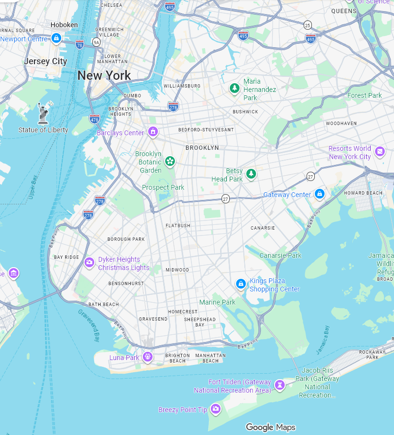
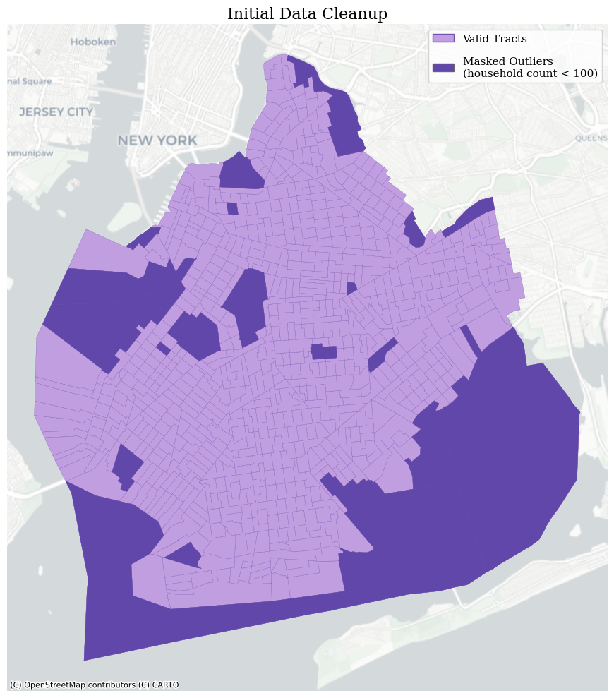
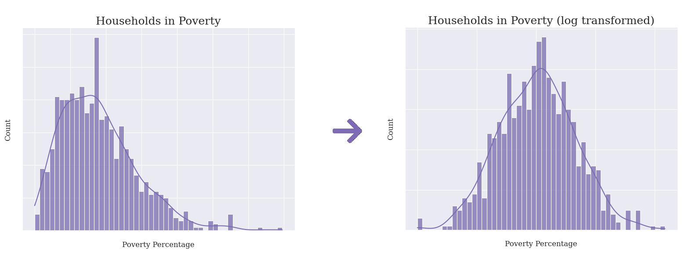
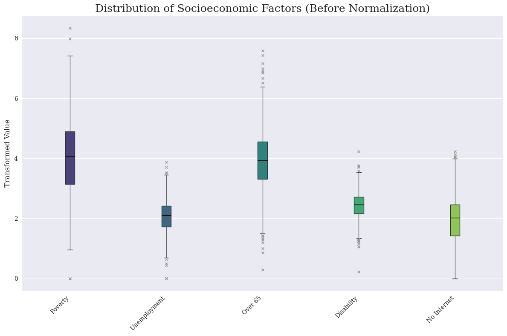
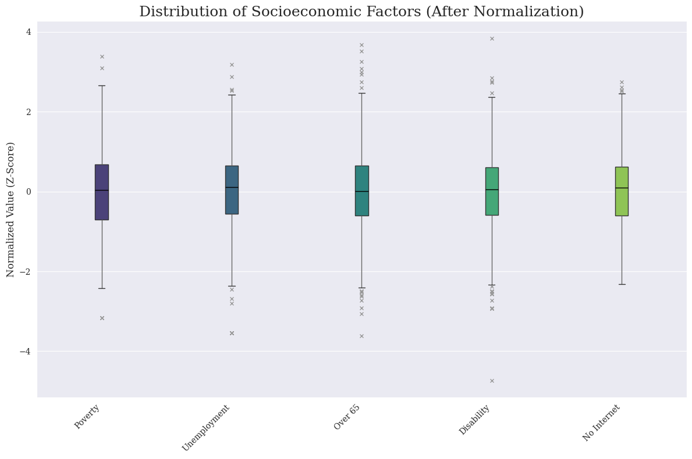

# Transit Equity Priority Index (TEPI): Identifying Spatial Vulnerability Patterns in Kings County Using Principal Component Analysis

A spatial analytics project that integrates socioeconomic, demographic, and digital-access indicators into a composite vulnerability index for census tracts in Kings County (Brooklyn), New York. The objective is to explore how multiple dimensions of disadvantage co-occur spatially and to provide a data-driven framework that may support equity-focused transportation planning.

---

## 📌 Project Overview

Transportation accessibility is shaped by more than infrastructure alone. Economic hardship, age, disability status, vehicle availability, and digital connectivity can collectively influence an individual's ability to access employment, healthcare, education, and essential services.

This project develops a **Transit Equity Priority Index (TEPI)** by combining six census-derived indicators of potential transportation disadvantage. Rather than assigning subjective weights to these variables, the analysis applies **Principal Component Analysis (PCA)** to identify latent patterns within the data and reduce dimensionality while retaining most of the underlying variance.

The resulting index highlights census tracts where multiple vulnerability factors are concentrated and may warrant further investigation for transportation equity interventions.

---

## 📊 Data Source & Preprocessing Pipeline

The analysis uses census-tract-level data obtained from the **American Community Survey (ACS)** for Kings County, NY.

The following indicators were extracted and aggregated:

1. **Zero-Vehicle Ownership** (ACS Table B25044)
2. **Poverty Status** (ACS Table B17017)
3. **Unemployment Rate** (ACS Table B23025)
4. **Population Over Age 65** (ACS Table B01001)
5. **Population with a Disability** (ACS Table B18101)
6. **Households Without Internet Access** (ACS Table B28011)

### Spatial Outlier Masking

Census tracts containing fewer than 100 households were excluded from analysis to reduce the influence of industrial areas, parks, transportation facilities, and other sparsely populated zones that may distort statistical distributions.

  
  
   
  <em>Figure 1: Census tract filtering process used to remove sparsely populated outliers.</em>

### Distribution Transformation

Several variables exhibited right-skewed distributions. Logarithmic and square-root transformations were applied where appropriate to reduce skewness and improve compatibility with PCA assumptions.

  
   
  <em>Figure 2: Example of distribution adjustment using logarithmic transformation.</em>

### Standardization

All variables were standardized using z-score normalization to ensure that differences in measurement scale did not disproportionately influence the PCA results.

  
  
   
  <em>Figure 3: Variable distributions following transformation and standardization.</em>

---

## 🔍 Principal Component Analysis Results

Principal Component Analysis was performed on the standardized dataset to identify latent patterns of vulnerability across census tracts.

The first four principal components explain approximately **88.5% of total variance**, indicating that they capture most of the variation present in the original six indicators.

| Socioeconomic Feature         |  PC1  |   PC2  |   PC3  |   PC4  |
| :---------------------------- | :---: | :----: | :----: | :----: |
| Households Below Poverty Line | 0.579 | -0.111 | -0.166 |  0.017 |
| No Internet Access            | 0.449 |  0.123 | -0.651 |  0.384 |
| Zero Vehicle Ownership        | 0.411 | -0.453 |  0.066 | -0.557 |
| Disability Status             | 0.383 |  0.461 |  0.251 | -0.444 |
| Unemployment Status           | 0.371 | -0.145 |  0.686 |  0.587 |
| Population Over 65            | 0.099 |  0.731 |  0.103 | -0.011 |

### Interpretation of Components

Because PCA components are mathematical constructs, the following interpretations should be viewed as descriptive rather than definitive.

#### PC1: General Socioeconomic Vulnerability (36.29%)

PC1 is strongly associated with poverty, lack of internet access, and zero-vehicle ownership. This component appears to capture areas where multiple indicators of socioeconomic disadvantage tend to occur together.

#### PC2: Age and Mobility-Related Vulnerability (25.35%)

PC2 is dominated by populations over age 65 and individuals with disabilities. This component may reflect areas where physical accessibility needs are more pronounced.

#### PC3: Employment–Connectivity Contrast (14.49%)

PC3 is characterized by high unemployment alongside relatively strong internet connectivity. This pattern may represent neighborhoods where digital access alone does not translate into improved employment outcomes.

#### PC4: Infrastructure and Access Disparity (12.37%)

PC4 combines unemployment and limited internet access while contrasting with vehicle ownership. This component may capture areas where mobility and connectivity challenges interact in distinct ways.

---

## 📊 Component Retention

To determine the number of components retained for index construction, a scree plot was examined.

A clear elbow appears after the fourth principal component, suggesting diminishing returns from additional components. Retaining four components preserves approximately **88.5% of total variance** while maintaining interpretability.

  
   
  <em>Figure 4: Scree plot used to evaluate component retention.</em>

---

## 🗺️ Spatial Distribution of Component Scores

Component scores were mapped back to census tracts to examine the geographic distribution of vulnerability patterns across Kings County.

  
   
  <em>Figure 5: Spatial distribution of the principal component scores across Kings County census tracts.</em>

---

## 🛠️ Construction of the Transit Equity Priority Index

The final index was generated by combining the retained principal components using weights proportional to their explained variance.

[
\text{TEPI} =
0.3629(PC_1) +
0.2535(PC_2) +
0.1449(PC_3) +
0.1237(PC_4)
]

This weighting scheme provides a statistically grounded baseline by emphasizing components that explain a larger share of overall variation. Alternative weighting approaches could be explored in future work.

---

## 🎯 Transit Equity Priority Map

The resulting Transit Equity Priority Index highlights census tracts where multiple vulnerability indicators are concentrated.

The map is intended as an exploratory planning tool rather than a prescriptive decision-making framework. Areas with elevated scores may warrant additional investigation using transportation network, accessibility, and service-level data.

  
   
  <em>Figure 6: Final Transit Equity Priority Index across Kings County census tracts.</em>

---

## 🚀 Potential Transportation Planning Applications

The index may support transportation planners by helping identify locations for more detailed accessibility analysis and targeted intervention strategies, including:

### Demand-Responsive Transit and Microtransit

Areas exhibiting high concentrations of vulnerability may benefit from flexible mobility services that improve first-mile and last-mile connectivity.

### Accessibility-Focused Infrastructure Improvements

Neighborhoods with elevated age- and disability-related vulnerability scores may warrant further evaluation for ADA-compliant infrastructure, pedestrian accessibility improvements, and enhanced transit amenities.

### Future Extensions

Potential future enhancements include:

* Integration of GTFS transit service data
* Accessibility and travel-time analysis
* Network-based equity metrics
* Spatial clustering techniques
* Machine learning approaches for vulnerability prediction
* Temporal analysis using multi-year ACS datasets

---

## 🔧 Technologies Used

* Python
* Pandas
* NumPy
* Scikit-Learn
* GeoPandas
* Matplotlib
* Census API
* Principal Component Analysis (PCA)

---

## 📚 Disclaimer

This project is intended as an educational and exploratory analysis. The resulting index reflects statistical relationships within the selected variables and should not be interpreted as a direct measure of transportation need without complementary transportation system and accessibility data.
