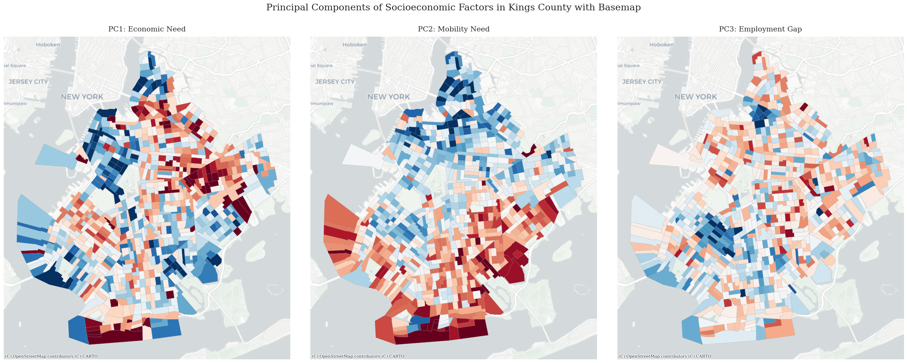
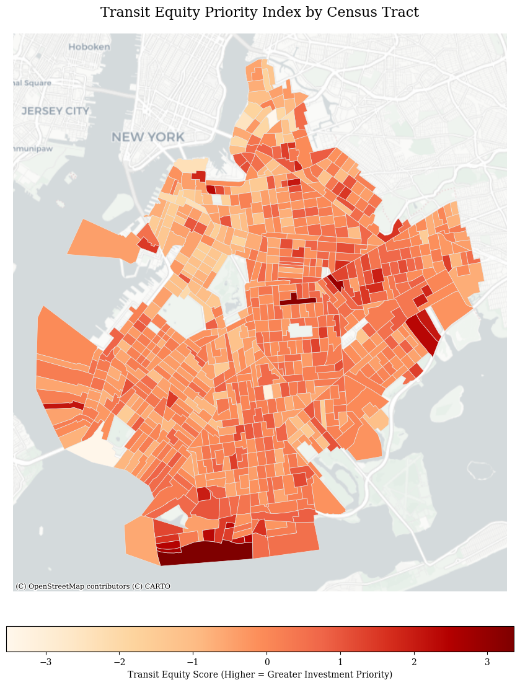
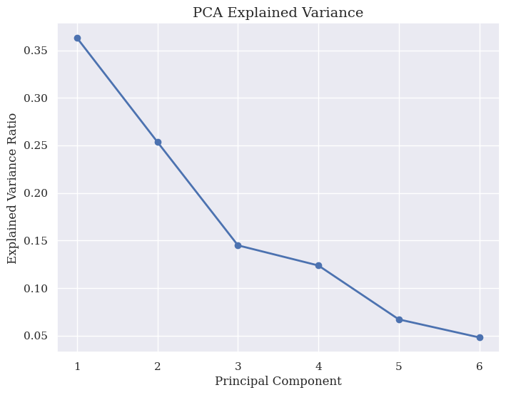

# Transit Equity Priority Index (TEPI): A Data-Driven Approach to Spatial Vulnerability in Kings County

A spatial optimization project that compresses multi-dimensional socioeconomic, physical, and digital barriers into a single, actionable index to guide equitable transit investments across Kings County (Brooklyn), NY.

---

## 📌 Project Executive Summary
Traditional transportation planning often optimizes for ridership volume or infrastructural convenience, unintentionally marginalizing communities facing compounding socio-spatial barriers. This project shifts the paradigm from simple cost-efficiency to **equity-driven intervention**. 

By evaluating six distinct census-level vulnerabilities—poverty, unemployment, zero car ownership, disability, advanced age, and digital exclusion—this model captures the invisible networks of physical and digital isolation. Rather than relying on arbitrary human weights, the project uses Principal Component Analysis (PCA) to isolate orthogonal socio-spatial signatures, mapping them directly onto Kings County tracts to identify where public transit interventions are most critically required for community survival.

---
## 📊 Data Source & Preprocessing Pipeline

This index relies on baseline **American Community Survey (ACS) census tract data** across Kings County, NY This pipeline extracts, cleans, and integrates data across six distinct demographic metrics at the census tract level:

1. **Zero-Vehicle Ownership** (ACS Table B25044)
2. **Poverty Status** (ACS Table B17017)
3. **Unemployment Rate** (ACS Table B23025)
4. **Age Vulnerability** (Population Over 65; ACS Table B01001)
5. **Physical Mobility Constraints** (Population with a Disability; ACS Table B18101)
6. **Digital Infrastructure Disconnect** (No Internet Access; ACS Table B28011)

### 1. Spatial Outlier Masking
Tracts with an extremely low sample size (**fewer than 100 households**) were filtered out to remove industrial zones, parks, or unpopulated transit hubs that could break statistical distributions.

  
  
   
  <em>Figure: Masking process separating valid study tracts from unpopulated outliers.</em>

### 2. Skewness Transformation
Right-skewed socioeconomic proportions were corrected using logarithmic or square-root transformations to handle outliers and conform closely to a normal Gaussian curve.

  
   
  <em>Figure: Shift in poverty feature distribution following log transformation.</em>

### 3. Standard Z-Score Scaling
Finally, the transformed variables were adjusted through Standard Scaling, shifting distributions to a uniform mean of 0 and standard deviation of 1. This ensures that features of differing magnitudes share equal baseline weight prior to variance evaluation.

  
  
   
  <em>Figure: Cleaned, symmetrical distribution profiles for the processed core variables.</em>

---
## 🗺️ Visualizing Transit Equity & Priority

### 1. Spatial Breakdown of Individual Component Vulnerabilities
The model isolates three primary socioeconomic and demographic signatures across the borough. Mapping these components reveals that vulnerability is not uniform; different neighborhoods face distinct types of structural isolation.

  
   
  <em>Figure 1: Spatial distribution of Systemic Economic Need (PC1), Physical Mobility Need (PC2), and the Structural Employment Gap (PC3) across Kings County census tracts.</em>

### 2. The Final Unified Transit Equity Priority Map
By combining the meaningful variance of these individual socioeconomic signatures, the model produces a final composite **Transit Equity Priority Index**. This acts as a localized blueprint for resource allocation, separating communities with deep structural barriers from high-resource zones.

  
   
  <em>Figure 2: Final integrated Transit Equity Priority Index by Census Tract in Kings County, highlighting high-priority investment zones.</em>

---

## 🔍 Data-Driven Planning Implications

The model processes six highly correlated variables. Through dimensionality reduction, the first four components capture **88.5% of the total variance** across the region. The mathematical weights (loadings) define exactly what type of disadvantage a tract faces:

| Socioeconomic Feature | PC1: Systemic Vulnerability (36.29%) | PC2: Age & Physical Mobility (25.35%) | PC3: Structural Employment Gap (14.49%) | PC4: Infrastructure Disconnect (12.37%) |
| :--- | :---: | :---: | :---: | :---: |
| **Households Below Poverty Line** | **0.579** | -0.111 | -0.166 | 0.017 |
| **Area with No Internet Usage** | **0.449** | 0.123 | **-0.651** | **0.384** |
| **Zero Car Ownership** | **0.411** | **-0.453** | 0.066 | **-0.557** |
| **Disability Status** | 0.383 | **0.461** | 0.251 | **-0.444** |
| **Unemployment Status** | 0.371 | -0.145 | **0.686** | **0.587** |
| **Population Over 65** | 0.099 | **0.731** | 0.103 | -0.011 |

### 💡 Core Planning Takeaways by Component

#### **PC1: Systemic Socioeconomic Vulnerability (36.29% Variance Explained)**
* **The Signature:** Heavily driven by deep Poverty (0.579), Digital Exclusion (0.449), and Zero Car Ownership (0.411).
* **Strategic Implication:** This is the core equity indicator. It highlights areas facing overlapping layers of economic and logistical disadvantage. In a transit context, these populations represent **high-dependence transit riders**. They do not choose public transit based on convenience; they rely on it entirely for basic survival, daily chores, healthcare, and accessing entry-level employment. 

#### **PC2: Age & Physical Mobility Needs (25.35% Variance Explained)**
* **The Signature:** Strongly dominated by Seniors (0.731) and People with Disabilities (0.461), while shifting cleanly away from Zero Car Ownership (-0.453).
* **Strategic Implication:** This component isolates physical and demographic vulnerability from purely financial hardship. Because car ownership is negatively loaded here, it points to older, established, or more suburban neighborhoods where seniors might own vehicles but face physical limitations in operating them or accessing standard infrastructure. Planning must pivot here toward **universal design and specialized service**—such as paratransit, low-floor buses, and ADA-compliant stop modifications—rather than high-frequency commuter routes.

#### **PC3: The Structural Unemployment Gap (14.49% Variance Explained)**
* **The Signature:** High Unemployment (0.686) contrasted sharply against excellent Internet Connectivity (-0.651).
* **Strategic Implication:** This component captures a modern urban friction: pockets where digital connectivity is strong, yet unemployment remains high. This signature is typical of younger, dense, or transitioning urban neighborhoods where residents are actively job-hunting, navigating the gig economy, or underemployed. Transit networks in these tracts must adapt to provide robust **off-peak, late-night, and flexible scheduling** to support non-traditional, irregular work hours.

#### **PC4: Disadvantaged Infrastructure Disconnect (12.37% Variance Explained)**
* **The Signature:** Co-occurring Unemployment (0.587) and Digital Isolation (0.384), contrasted with active Car Ownership (-0.557) and lower physical disabilities (-0.444).
* **Strategic Implication:** This component isolates neighborhoods that are digitally and economically left behind but maintain vehicles out of absolute necessity. This signature is typical of working-class, peripheral, or transit-desert communities where possessing a car is a mandatory survival requirement due to a total lack of transit infrastructure. Families in these tracts are forced to take on heavy **vehicle-inherent debt and high fuel burdens** despite low incomes, signaling a critical need for new physical transit lines to alleviate financial stress.

---

## 🛠️ Index Synthesis & Mathematical Framework

To establish a mathematically rigorous investment baseline, the final **Transit Equity Priority Score** for each tract is calculated by weighting each independent component by its percentage of explained variance. This ensures that the most prominent structural patterns carry proportional weight in the final index:

$$\text{Transit Equity Score} = 0.3629(\text{PC}_1) + 0.2535(\text{PC}_2) + 0.1449(\text{PC}_3) + 0.1237(\text{PC}_4)$$

  
   
  <em>Figure 3: Scree plot outlining the mathematical elbow drop-off after PC4, validating the inclusion of 88.5% of overall tract variance.</em>

---

## 🚀 Targeted Policy Interventions

Based on the geographic clusters identified in the final index (Figure 2), transportation investments should be deployed using two distinct strategies:

1.  **Demand-Responsive Transport (DRT) & Micro-Transit for High-Priority Zones (Deep Red):** Peripheral high-priority clusters (e.g., eastern Brooklyn and southern coastal edges like Coney Island) exhibit intense intersections of economic need and digital/physical isolation. Because these areas often lack dense subway infrastructure, flexible, subsidized micro-transit systems or micro-mobility hubs can bridge the first-and-last-mile gaps efficiently.
2.  **Targeted Infrastructure & Digital Integration Upgrades:** Deploying ADA-compliant streetscapes, smart bus shelters with real-time arrivals, and localized transit-digital kiosks directly mitigates the specific physical and digital barriers isolated by the underlying model components, ensuring technology and infrastructure serve those who depend on them most.
